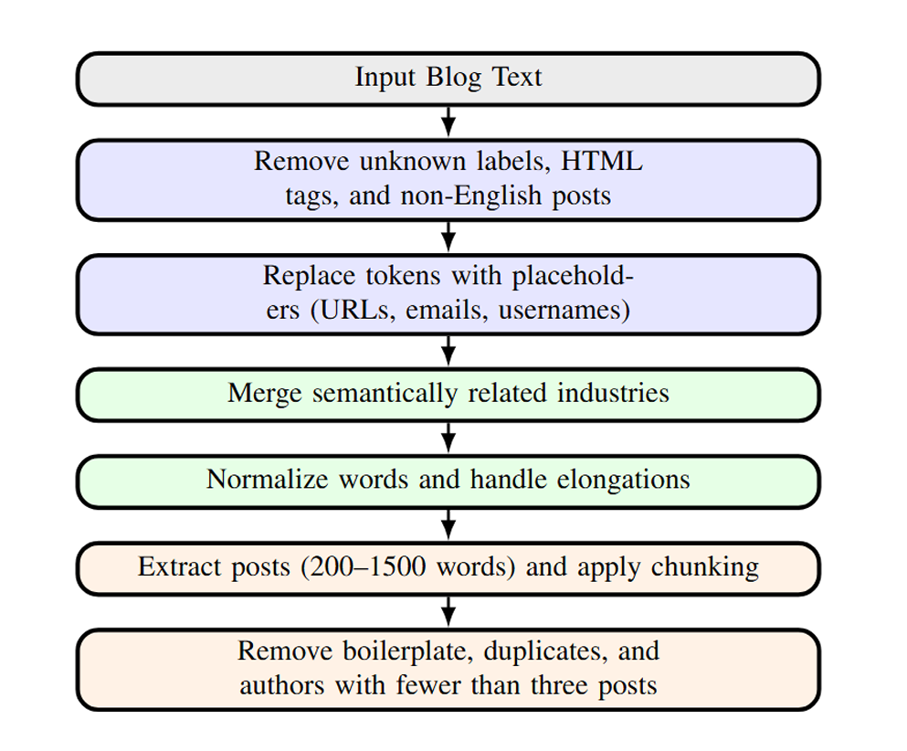

### 📝 Cleaned Blog Corpus

This contains [a cleaned version of the Blog Authorship Corpus](https://www.kaggle.com/datasets/bintuulugbek/cleaned-blog-authorship-corpus),
prepared for machine learning experiments in author profiling 
(gender, age group, industry classification).

### 🔧 Cleaning Process

### 🎯 Usage
#### This dataset can be used for:
- Text classification (gender, age, industry prediction)
- Stylometry & author profiling research
- Linguistic analysis across demographic groups

### 📊 Statistics about dataset 
The [Blog Authorship Corpus](https://www.kaggle.com/datasets/rtatman/blog-authorship-corpus) consists of the collected posts of 19,320 bloggers gathered from blogger.com in August 2004. The corpus incorporates a total of 681,288 posts and over 140 million words - or approximately 35 posts and 7250 words per person.
Each blog is presented as a separate file, the name of which indicates a blogger id# and the blogger’s self-provided gender, age, industry and astrological sign. (All are labeled for gender and age but for many, industry and/or sign is marked as unknown.)

All bloggers included in the corpus fall into one of three age groups:

8240 "10s" blogs (ages 13-17),
8086 "20s" blogs(ages 23-27)
2994 "30s" blogs (ages 33-47).
For each age group there are an equal number of male and female bloggers.

Each blog in the corpus includes at least 200 occurrences of common English words. All formatting has been stripped with two exceptions. Individual posts within a single blogger are separated by the date of the following post and links within a post are denoted by the label urllink.

### ✨ After Cleaning
96199 posts;
5437 authors with 3 age groups and 14 industry labels
average posts per author: ~17

### ✔️ Note
- This is a processed version of the Blog Authorship Corpus.
- Original dataset credit: Jonathan Schler et al. (2006).
- Use responsibly for research and educational purposes.
